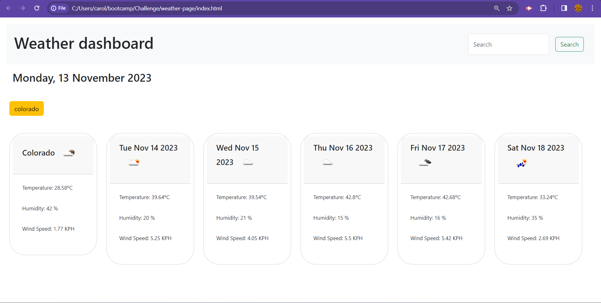

# Challenge-06
Weather webpage
This weather page presents the weather data of the city selected in the search bar at top right of the page; then the page loads the current weather and the forecast of the next 5 days. The weather data is composed of temperature, humidity and wind speed. It also keeps the information on the top bar of each of the cities that were searched.

Link to weather page: https://ambersanti1.github.io/weather-page/